# portfolio-modern

現代化的個人檔案系統，以結構化方式組織與呈現個人介紹、學經歷、旅程、專案經驗與技能，並提供英文、簡體中文、繁體中文內容 API。

A modern personal profile system that organizes profile information, education and work experience, journeys, projects, and skills through structured data and serves content in English, Simplified Chinese, and Traditional Chinese.

本專案以 **輕量化開發與部署** 為目標：依實際功能引入依賴，控制常駐服務與資源使用，維持清楚、容易理解的模組結構。

The project aims for **lightweight development and deployment**: add dependencies as features require them, control resource usage and persistent services, and keep the module structure clear.

**後端公開讀取 API 與 React 前端功能已實作。** `backend/` 放置後端程式；`frontend/` 使用 React Router Framework Mode、React 與 TypeScript，已重構既有 `portfolio-web`，細節見[前端 README](frontend/README.md)。

**Public read APIs and the React frontend are implemented.** `backend/` contains backend code. `frontend/` uses React Router Framework Mode, React, and TypeScript for the completed feature migration of `portfolio-web`; see the [frontend README](frontend/README.md).

閱讀入口 / Reading guide：[網站圖解 / Website tour](#網站圖解--website-tour)、[專案架構 / Architecture](#專案架構--project-architecture)、[本機安裝 / Local setup](#從乾淨-checkout-安裝--install-from-a-fresh-checkout)、[正式部署 / Production deployment](#前後端正式部署--production-deployment)。

## 網站圖解 / Website Tour

以下以實際網站截圖與功能局部裁切介紹操作方式。圖片集中在 [`docs/images/`](docs/images/README.md)，點擊可查看原始尺寸。畫面中的個人介紹、日期、經歷、專案與技能由 API 提供，會隨作品集資料更新。

The tour uses real website screenshots and focused crops. Images live in [`docs/images/`](docs/images/README.md) and link to their original size. Profile content, dates, experience, projects and skills come from the API and may change as portfolio data is updated.

### 1. 首頁與區段導覽 / Overview and Section Navigation

[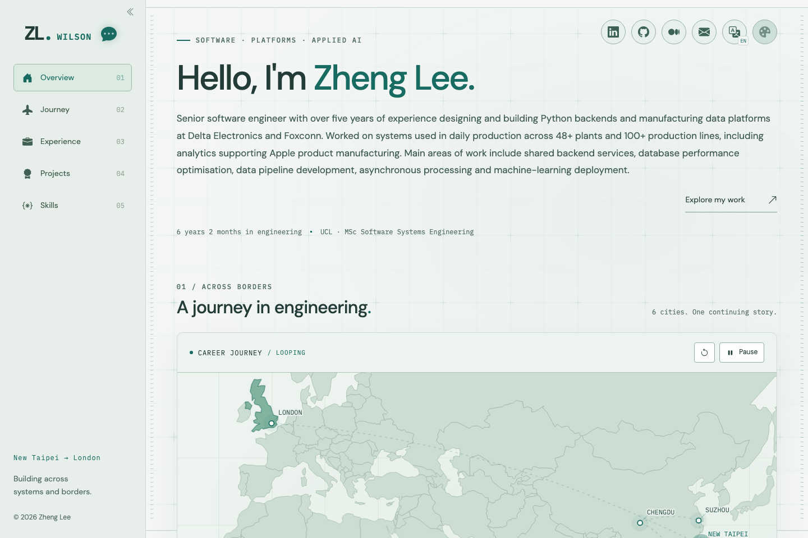](docs/images/overview-desktop.png)

左側導覽連到 Overview、Journey、Experience、Projects、Skills 五個區段，隨捲動標示目前位置，也可收合以增加閱讀空間。首頁呈現個人介紹、累積年資與目前學習方向；右上角集中社群、Email、語言與外觀入口。

The left rail links to five sections, follows the current scroll position, and can collapse to give content more room. The overview presents the profile, engineering tenure and current study direction. Social links, email, language and appearance controls sit at the upper right.

### 2. 旅程地圖 / Interactive Journey

[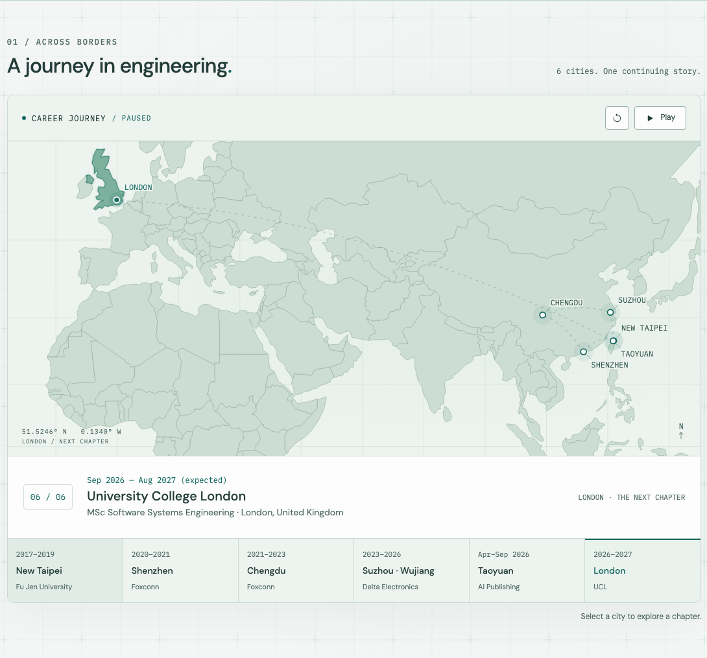](docs/images/journey-map.png)

地圖把學習與工作的城市串成旅程。播放時，飛機沿路徑前進並依序切換章節；可暫停、重播，或直接選擇下方城市。點擊／聚焦地圖上的城市可查看地點介紹，下方摘要同步呈現組織、期間與角色。

The map connects education and work locations. Playback moves a plane along the route and advances through chapters. Visitors can pause, restart or select a destination from the strip. Clicking or focusing a map marker opens its introduction; the summary follows the selected organization, period and role.

### 3. 學經歷 / Education and Work Experience

[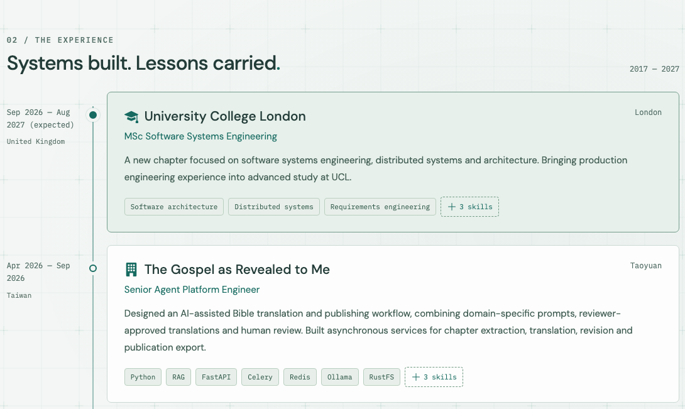](docs/images/experience-cards.png)

左側日期與節點提供時間順序，右側卡片呈現學校／公司、角色、地點、內容與相關技能。上圖裁切出最近兩筆經歷；頁面可繼續往下閱讀。技能標籤共用展開元件，較長清單以「＋N skills」保留入口。

Dates and nodes establish the chronology, while cards show the organization, role, location, description and related skills. This crop focuses on two recent entries; more remain below. Long skill lists use the shared disclosure component and retain a “+N skills” control.

### 4. 專案時間軸與詳情 / Project Timeline and Detail

[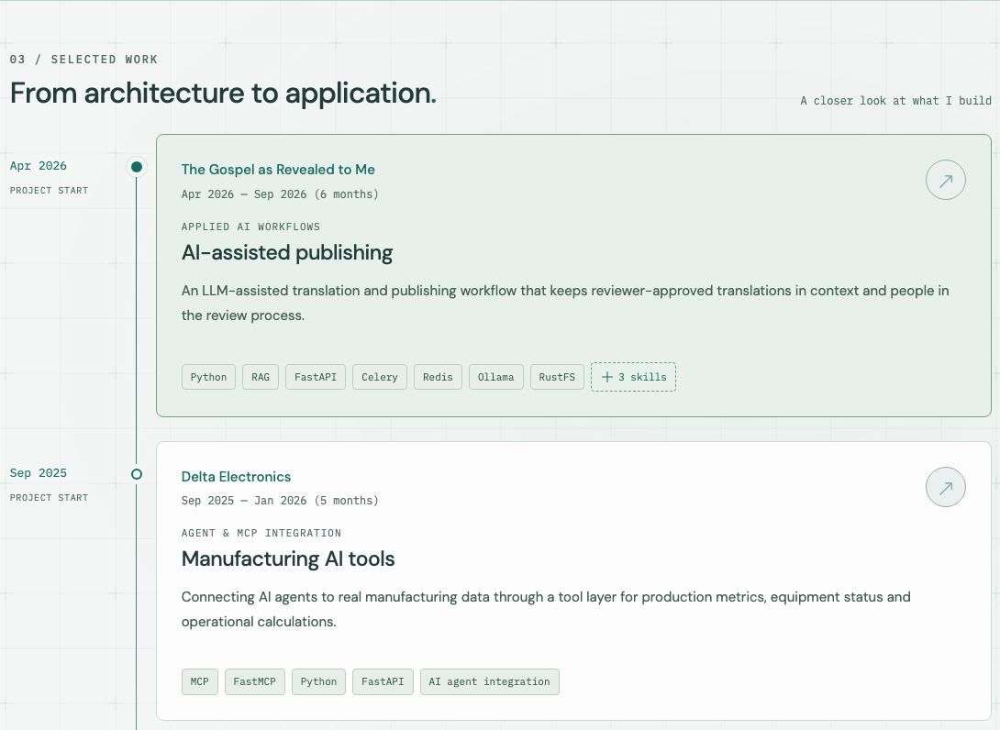](docs/images/project-timeline.png)

專案按開始月份分組，預設突出第一個月份的節點；桌面滑鼠移到其他卡片時，該月份以較大的光暈與 heartbeat 回饋選擇。卡片顯示期間、摘要及技能；有詳細內容時，右上角箭頭會開啟對話框。更多專案透過區段下方的展開入口讀取。

Projects are grouped by their starting month. The first month is emphasized by default; hovering another card on desktop moves the larger halo and heartbeat feedback to its month. Cards show periods, summaries and skills; a corner arrow opens available detail. The section disclosure loads additional projects.

[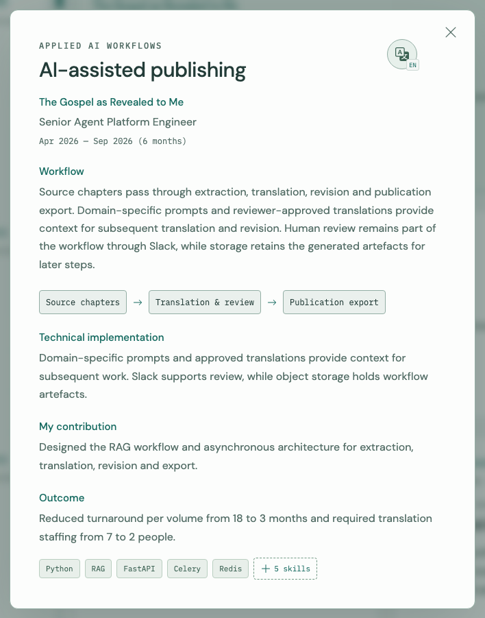](docs/images/project-detail.png)

詳情對話框把工作流程、技術實作、個人貢獻與成果分段呈現，流程步驟以箭頭串接；內容可在框內捲動。關閉或按 Escape 後回到原專案入口，對話框內也保留語言切換。

The scrollable dialog separates workflow, implementation, contribution and outcomes, with connected workflow steps. Closing it or pressing Escape restores the project trigger. A language control remains available inside the dialog.

### 5. 技能分類與展開 / Skills and Disclosure

[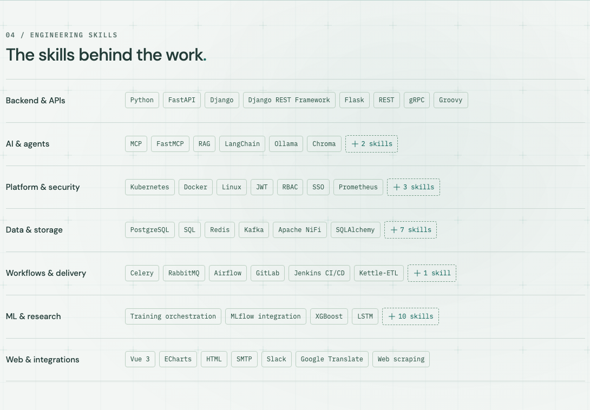](docs/images/skills-toolkit.png)

所有技能分類預設呈現。每列依可用寬度安排標籤；需要收合時，以約 75% 的預覽寬度保留「＋N skills」的空間，而不是固定顯示六個標籤。分類與分類內技能分別使用頁碼 API，畫面仍維持一份連續的技能清單。

All categories are visible by default. Tags adapt to the available width; when disclosure is needed, the preview uses roughly 75% of the row and leaves space for “+N skills,” rather than imposing a fixed six-tag limit. Category and owner-skill pagination remain separate while the UI presents one continuous toolkit.

### 6. 主題、背景與進場 / Appearance and Entrance

| 淺色 Mist / Light Mist                                                                                                                               | 深色 Mint / Dark Mint                                                                                                                             |
| ---------------------------------------------------------------------------------------------------------------------------------------------------- | ------------------------------------------------------------------------------------------------------------------------------------------------- |
| [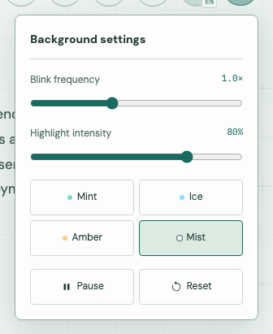](docs/images/appearance-light.png) | [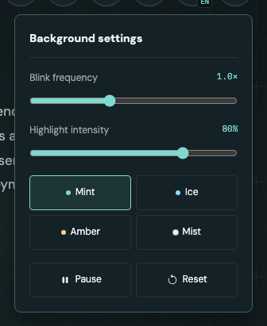](docs/images/appearance-dark.png) |

設定包含 Mint、Ice、Amber、Mist 四種色票，以及背景閃爍頻率、亮度、暫停與重設。主題切換沿用同一份全域外觀狀態；滑鼠光暈與背景訊號也跟隨設定。

The menu provides Mint, Ice, Amber and Mist palettes, background frequency, intensity, pause and reset. Global appearance state also controls the pointer halo and background signals.

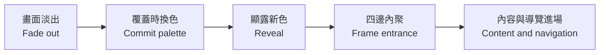

換色採 400ms 覆蓋、400ms 顯露，再重播原有 1400ms 進場序列。四邊先收進，內容與左側導覽依原本節奏淡入；手機則播放固定 header 的進場。連續選色合併到最後一次，保留資料、焦點與捲動位置。啟用 Reduced Motion 時直接套色。

A 400ms cover and 400ms reveal precede the shared 1400ms entrance. The frame settles first, followed by content and the rail; mobile uses its fixed header. Rapid choices coalesce, preserving data, focus and scroll. Reduced Motion applies the palette immediately.

### 7. 三語與聯絡介紹 / Languages and Contact

[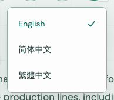](docs/images/language-menu.png)

語言選單提供英文、簡體中文與繁體中文，切換 UI 及 API 內容，並更新對應 URL。語言更新成功前保留原內容；失敗時仍可繼續閱讀。

The menu switches both UI copy and API content across English, Simplified Chinese and Traditional Chinese, updating the locale URL. Existing content stays visible until the new language is ready and remains usable if preparation fails.

[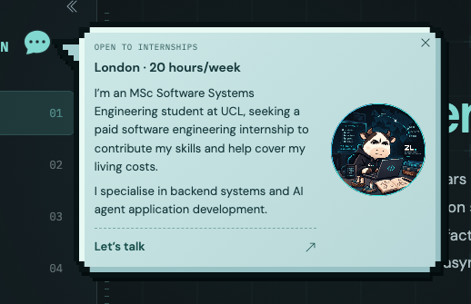](docs/images/contact-introduction.png)

品牌旁的 chat 圖示開啟聯絡介紹，使用像素包邊、吉祥物與 Email 入口。首次進場可自動介紹，完整閒置約 3 秒後淡出；滑鼠停在框內或以鍵盤閱讀時延後關閉。這是履歷聯絡入口，沒有即時聊天室服務。

The brand's chat icon opens an introduction with a stepped frame, mascot and email action. Startup may offer it automatically, then fade after about three idle seconds. Hover or keyboard engagement extends reading time. It is a CV contact entry, with no real-time chat service.

### 8. 平板與手機 / Tablet and Mobile

[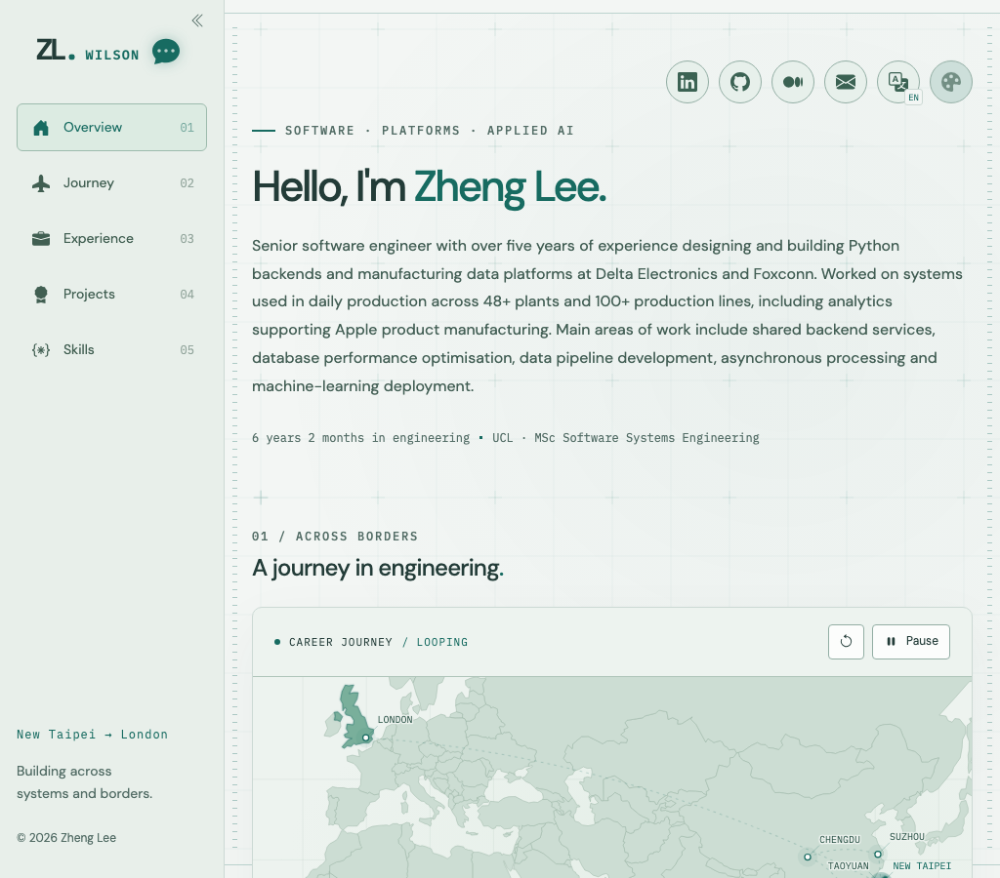](docs/images/overview-tablet.png)

平板保留側邊導覽，內容與工具列依寬度重新配置；760px（含）以下改用手機固定 header 與抽屜導覽。下面以 390px 畫面示範首頁與選單展開狀態。

Tablet keeps the rail while content and controls adapt to the width. At 760px and below, a fixed mobile header and navigation drawer replace it. The 390px screenshots below show the overview and open drawer.

| 手機首頁 / Mobile Overview                                                                                                                                                                                    | 手機導覽 / Navigation Drawer                                                                                                                                                     |
| ------------------------------------------------------------------------------------------------------------------------------------------------------------------------------------------------------------- | -------------------------------------------------------------------------------------------------------------------------------------------------------------------------------- |
| [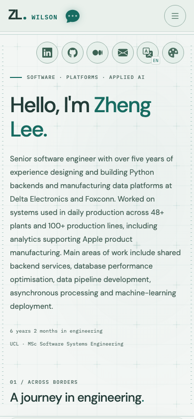](docs/images/overview-mobile.png) | [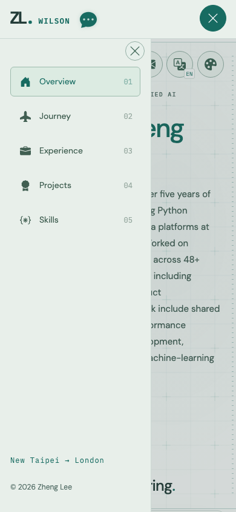](docs/images/navigation-mobile.png) |

完整元件介面、資料防呆、共用模組與 RWD 規格見[前端 README](frontend/README.md)，環境與啟動方式見下方[安裝步驟](#從乾淨-checkout-安裝--install-from-a-fresh-checkout)。

See the [frontend README](frontend/README.md) for component contracts, fault handling, shared modules and responsive specifications, and the [installation guide](#從乾淨-checkout-安裝--install-from-a-fresh-checkout) below for setup.

### 9. 登入介面與草地牛 / Account Forms and Cow Workspace

| 登入 / Sign In                                                                                                                                                                                                                  | 註冊 / Registration                                                                                                                                                                                                                     |
| ------------------------------------------------------------------------------------------------------------------------------------------------------------------------------------------------------------------------------- | --------------------------------------------------------------------------------------------------------------------------------------------------------------------------------------------------------------------------------------- |
| [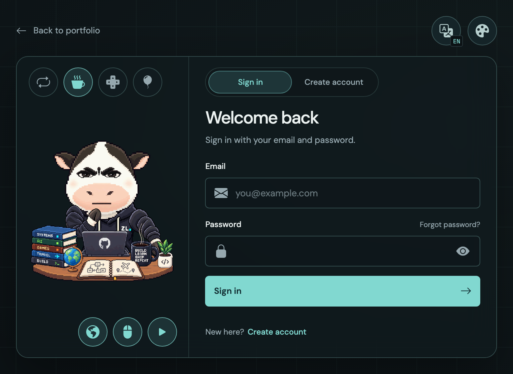](docs/images/auth-login-desktop.png) | [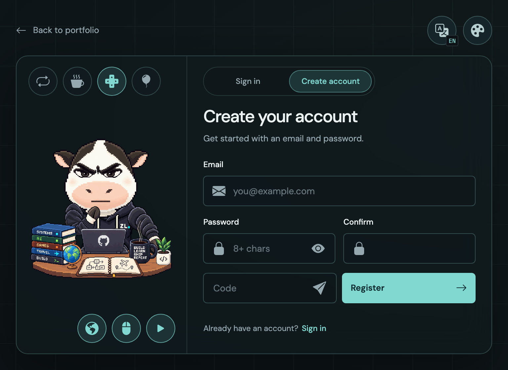](docs/images/auth-register-desktop.png) |

導航列的開門圖示進入目前語系的 `?view=login`：導覽收合、作品集淡出，左右邊框對撞再展開登入框。介面提供信箱與密碼登入、註冊及忘記密碼；註冊包含驗證碼欄位與發送入口，密碼使用圖示切換顯示。各模式共用相同框體尺寸，手機與窄平板將牛場景放到表單上方；語言、主題、返回作品集及瀏覽器上一頁／下一頁保持可用。

The door icon opens `?view=login` on the current locale route. Navigation retracts, the portfolio fades, and the side rails collide before revealing the account card. Email/password sign-in, registration and password recovery share one card size. Registration includes a verification-code field and send action; an icon toggles password visibility. Narrow layouts place the cow above the form. Language, appearance, portfolio return and browser history remain available.

登入／註冊切換列支援點擊、鍵盤及滑鼠／觸控水平拖曳，放開後依中點吸附；未跨中點或取消時保留目前表單內容。切換採動態島式收合與展開：舊內容縮小、模糊並淡出，新內容短距離滑入、展開及輕微回彈。卡片上下各留 16px，牛控制鈕與切換列均為 44px 高，上下邊緣對齊。註冊的確認欄精簡為 Confirm，密碼不一致時以紅色 Mismatch 提醒。

The sign-in/registration switch supports clicks, keyboard activation and horizontal mouse/touch dragging, snapping at the midpoint on release. Short or cancelled drags retain the current form values. Dynamic Island-style switching shrinks, blurs and fades the old content, then brings the new content a short distance into view with expansion and a gentle rebound. The card has equal 16px top/bottom insets; 44px cow controls align with the switch edges. Registration uses a concise Confirm label and a red Mismatch warning for differing passwords.

[](docs/images/auth-cow-workspace.png)

草地牛沿用分層 SVG 與 2.5D 視差，預設以「思考 → 敲代碼 → 看你 → 敲代碼」循環，每個表情停留三秒。場景按鈕可選表情、暫停地球、停止滑鼠跟動，以及以單一按鈕切換播放／暫停；按鈕共用三語像素提示氣泡。滑鼠在整個頁面依輸入區中心控制視差，動態遵守減少動態效果、全域暫停與可見性設定。原本準備素材的獨立預覽頁已移除，向量原稿與重建、比對工具保留；詳見[牛場景文件](frontend/src/shared/ui/cow-workspace/README.md)。

The layered SVG cow uses 2.5D parallax and cycles through thinking, typing, watching and typing, holding each expression for three seconds. Controls select expressions, pause globe rotation, disable mouse tracking and toggle playback with one button. They share localized pixel tooltips. Tracking covers the page around the input region, and motion respects accessibility, global pause and visibility preferences. The preparation preview page has been removed; vector sources and rebuild/parity tools remain in the [cow workspace guide](frontend/src/shared/ui/cow-workspace/README.md).

[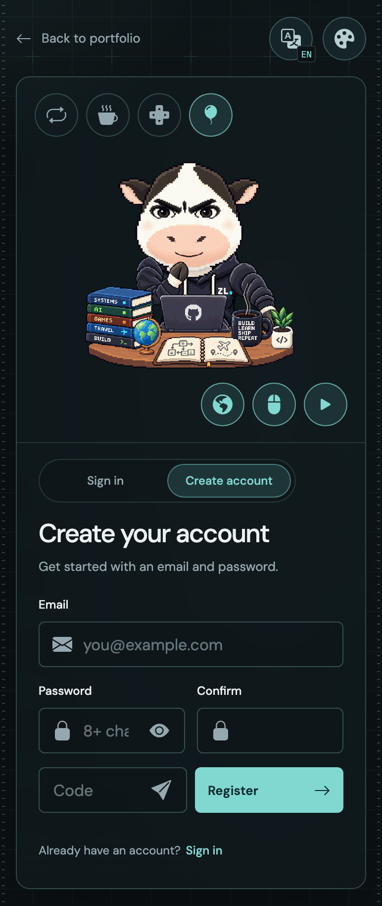](docs/images/auth-mobile.png)

390px 手機版將牛場景、控制列及表單改為上下排列，保留全部七個場景按鈕；短視窗可捲動整張卡片，水平拖曳切換不影響垂直捲動。

At 390px, the cow, controls and form stack vertically while retaining all seven scene buttons. Short viewports scroll the whole card, and horizontal switching preserves vertical touch scrolling.

目前帳號操作僅為前端介面：密碼與驗證碼留在當前表單，尚未送出或儲存。發送入口以綠色提示搭配 send-fill 顯示「驗證碼已送出」、有效 5 分鐘，並啟動 5 分鐘冷卻倒數；這是送出狀態的展示預覽，沒有實際寄信或伺服器驗證。登入驗證、SMTP、註冊與密碼復原 API 尚未串接，其他有效送出仍顯示服務尚未提供的提示。

Account actions currently provide UI only: passwords and verification codes remain in the current form without transmission or storage. The send action shows a green send-fill notification stating that a code was sent and is valid for five minutes, then starts a five-minute cooldown. This is a sent-state presentation preview without email delivery or server verification. Authentication, SMTP, registration and password recovery endpoints remain unconnected; other valid submissions report that the service is unavailable.

## 目前進度 / Current status

- 已完成 FastAPI 啟動入口、六支公開 Portfolio GET API、線上人數診斷 API，以及本機 Swagger／ReDoc。
- 後端使用單一非同步 SQLite 或 PostgreSQL 連線管理器；Redis 用於 session、心跳與可選的 HTTP 快取。
- 已建立作品集與帳號 ORM 模型、初版 Alembic migration 及三語 mock 匯入腳本；migration 須手動執行，登入與寫入 API 尚未實作。
- React Router、React、TypeScript、Bootstrap 樣式與图示已完成版型及六 API 整合，包含三語、經歷／專案／技能分頁、地圖播放、詳情、外觀與聯絡互動；四 URL 靜態內容、區段容錯與正式檢查工具可使用。
- 登入／註冊／忘記密碼前端、登入轉場及草地牛場景已整合，支援三語、RWD、共用提示與獨立動畫控制；帳號及 SMTP API 尚未串接。

- The backend has a FastAPI entry point, six public Portfolio GET APIs, an online-count diagnostic endpoint, and local Swagger/ReDoc.
- One async connection manager supports SQLite or PostgreSQL; Redis supplies sessions, heartbeats, and optional HTTP response caching.
- Portfolio and account ORM models, an initial Alembic migration, and a three-language mock importer are present. Migrations run manually; login and write APIs are not implemented.
- The React frontend integrates six APIs with three languages, numbered collections, maps/playback, detail dialogs, appearance and contact interactions. Four static URLs, independent fault recovery and verification tooling are available.
- Sign-in, registration and password-recovery UI, the entrance transition and cow workspace are integrated with three languages, responsive layouts, shared tooltips and independent animation controls. Account and SMTP endpoints are not yet connected.

## 技術選擇 / Technology choices

| 項目 / Tool                                          | 用途                                                                     | Purpose                                                                                    |
| ---------------------------------------------------- | ------------------------------------------------------------------------ | ------------------------------------------------------------------------------------------ |
| Python                                               | 目前宣告支援 Python 3.13 以上                                            | Currently declares Python 3.13 or later                                                    |
| uv                                                   | Python 專案、依賴、虛擬環境與鎖定檔管理                                  | Python project, dependency, environment, and lockfile management                           |
| FastAPI                                              | API 框架                                                                 | API framework                                                                              |
| Uvicorn                                              | ASGI 伺服器，採用 `uvicorn[standard]`                                    | ASGI server with the `standard` extras                                                     |
| Pydantic                                             | 請求與回應資料驗證                                                       | Request and response validation                                                            |
| pydantic-settings                                    | 環境設定讀取與驗證                                                       | Environment configuration loading and validation                                           |
| SQLAlchemy                                           | ORM 與資料庫操作，包含 asyncio 額外依賴                                  | ORM and database operations with asyncio extras                                            |
| Alembic                                              | 資料庫結構版本管理                                                       | Database schema migrations                                                                 |
| redis、fastapi-cache2                                | Redis client 與 WEB cache；GET API 可透過 `is_caching=true` 使用回應快取 | Redis clients and WEB cache; GET APIs can opt into response caching with `is_caching=true` |
| fastapi-utils                                        | CBV 路由寫法                                                             | Class-based view routing                                                                   |
| python-socketio                                      | Socket.IO ASGI 組裝                                                      | Socket.IO ASGI assembly                                                                    |
| HTTPX                                                | HTTP client 設定，執行依賴                                               | HTTP client configuration; runtime dependency                                              |
| Black                                                | Python 排版，開發依賴                                                    | Python formatter; development dependency                                                   |
| pytest                                               | 測試工具，開發依賴                                                       | Test runner; development dependency                                                        |
| Docker                                               | 按需啟動外部服務、容器驗證或部署                                         | On-demand external services, container validation, or deployment                           |
| React Router Framework Mode、React、TypeScript、Vite | 已初始化的前端路由、畫面與建置                                           | Initialized frontend routing, UI, and build tools                                          |
| Bootstrap、React-Bootstrap、Bootstrap Icons          | 樣式、React 元件與 SVG 圖示                                              | Styles, React components, and SVG icons                                                    |

具體依賴宣告見 [backend/pyproject.toml](backend/pyproject.toml)，解析後版本以 `backend/uv.lock` 為準；前端依賴見 [frontend/package.json](frontend/package.json) 與 `frontend/package-lock.json`。

Dependency declarations are in [backend/pyproject.toml](backend/pyproject.toml); resolved versions are recorded in `backend/uv.lock`. Frontend dependencies are recorded in [frontend/package.json](frontend/package.json) and `frontend/package-lock.json`.

目前的 `ConnectionManager` 支援單一非同步 SQLite 或 PostgreSQL engine，並提供每次操作新建的 `AsyncSession`。`asyncpg` 與 `aiosqlite` 都是正式依賴。`SYSTEM/models/` 定義 ORM 模型，Alembic 使用其 metadata；安裝 Python 用戶端套件不代表已安裝或啟動資料庫、Redis 服務。

`ConnectionManager` supports one async SQLite or PostgreSQL engine and returns a fresh `AsyncSession` for each operation. Both `asyncpg` and `aiosqlite` are runtime dependencies. `SYSTEM/models/` defines the ORM models whose metadata Alembic uses. Installing Python clients does not install or start database or Redis services.

## 輕量化原則 / Lightweight development principles

- 日常在 macOS 以 uv 虛擬環境直接開發 FastAPI，Docker 按需啟動。
- WEB cache 由 Redis 提供；讀取 API 透過 `is_caching` 選擇是否使用短時間回應快取。
- 初期採單一後端服務，避免預先拆分微服務或引入多套排程、訊息佇列系統。
- 目前啟動入口維持單一 worker；依實測負載調整資料庫連線池與快取上限，多 worker 擴充須先改造啟動入口。
- 開發工具與正式執行依賴分開管理。
- 共用能力按實際重用需求抽取，避免為簡單功能建立過多抽象層。

- Develop FastAPI directly on macOS in a uv virtual environment; start Docker only when needed.
- Redis provides WEB cache; read APIs use `is_caching` to opt into short-lived response caching.
- Start with one backend service, without prematurely introducing microservices, multiple schedulers, or message queues.
- Keep the current entry point on one worker; tune connection pools and cache limits using measured workloads. Multiple workers require an entry-point change first.
- Manage development tools separately from runtime dependencies.
- Extract shared functionality when reuse is justified; keep simple features free of unnecessary abstraction.

## 專案架構 / Project architecture

以下顯示目前主要的程式模組與前端模組。後端實作細節見[後端 README](backend/README.md)，前端的目錄、責任與開發規範見[前端 README](frontend/README.md)。

The tree shows current backend modules and frontend modules. See the [backend README](backend/README.md) for implementation details and the [frontend README](frontend/README.md) for the layout, responsibilities, and development standards.

```text
portfolio-modern/
├── README.md
├── docs/images/                  # Website screenshots and focused feature crops
├── frontend/
│   ├── README.md                 # Frontend architecture and development guide
│   ├── src/
│   │   ├── root.tsx / routes.ts   # Document shell and route declarations
│   │   ├── app/                  # Providers and shared QueryClient assembly
│   │   ├── routes/               # URL entry, loaders, pre-render data and SEO
│   │   ├── pages/portfolio/      # Page composition, navigation and entrance
│   │   ├── features/            # Site, journey, experiences, projects, skills,
│   │   │                        # appearance, language, online visitors and auth
│   │   ├── shared/              # Reusable API infrastructure, UI and utilities
│   │   ├── i18n/                # Locale setup, dictionaries and copy helpers
│   │   ├── styles/              # Design tokens and global styles
│   │   └── assets/              # Imported fonts, map and illustrations
│   ├── public/                  # Unprocessed favicon and license files
│   ├── scripts/                 # Accepted builds, artifact checks and preview
│   ├── deploy/                  # Generic Nginx configuration example
│   ├── tests/                    # Unit/component and browser verification
│   ├── .env.example             # Public environment template
│   ├── package.json / package-lock.json
│   └── react-router.config.ts / vite.config.ts / tsconfig.json
└── backend/
    ├── APPs/
    │   ├── Portfolio/            # Six public content GET APIs
    │   │   ├── views_portfolio.py
    │   │   ├── module/
    │   │   └── schema/
    │   └── Sys/                  # Online-count diagnostic API
    ├── COMMON/
    │   ├── decorator/
    │   ├── schema/               # Shared help, parsers, responses
    │   └── tools/storage/        # Redis and SQLAlchemy helpers
    ├── SYSTEM/
    │   ├── config.yaml           # Published development defaults; replace production secrets
    │   ├── settings.py
    │   ├── lifespan.py
    │   ├── database/             # Async DB and Redis connection manager
    │   ├── models/               # Portfolio, auth, Alembic migrations
    │   ├── middleware/
    │   ├── static/               # Local Swagger/ReDoc assets
    │   └── tools/                # Router, docs, Socket.IO assembly
    ├── manage_fastapi.py
    ├── test.py                   # Three-language mock importer
    ├── alembic.ini
    ├── pyproject.toml
    └── uv.lock
```

- `APPs`：按 Portfolio 與 Sys 模組組織 API。`views` 定義 CBV 路由，`schema` 解析參數及驗證回應，`module` 執行業務查詢。
- `COMMON`：跨模組共用的裝飾器、例外、資料格式與工具。
- `SYSTEM`：系統設定、路由定義、生命週期、資料庫基礎設施與 middleware。
- `SYSTEM/models`：作品集與帳號的 ORM 模型，以及 Alembic migration；資料表需手動遷移。
- `manage_fastapi.py`：目前的 FastAPI、文件與 Socket.IO 組裝及啟動入口。

- `APPs`: Portfolio and Sys APIs. `views` declares CBV routes, `schema` parses parameters and validates responses, and `module` runs business queries.
- `COMMON`: Decorators, exceptions, schemas, and utilities shared across modules.
- `SYSTEM`: Configuration, route definitions, lifecycle management, database infrastructure, and middleware.
- `SYSTEM/models`: Portfolio and account ORM models and Alembic migrations; apply migrations manually.
- `manage_fastapi.py`: The current FastAPI, docs, and Socket.IO assembly and startup entry point.

`backend/SYSTEM/config.yaml` 提供可提交的開發預設配置；`backend/SYSTEM/settings.py` 負責整理設定。正式環境須使用私有配置替換 `SECURITY.secret_key` 與服務連線值，實際機密不回寫公開儲存庫。前端共用模組的介面與範例見[共用模組 SPEC](frontend/src/shared/README.md)，後端啟動與各工具規格見[後端 README](backend/README.md)。

`backend/SYSTEM/config.yaml` contains published development defaults, organized by `backend/SYSTEM/settings.py`. Production replaces the signing key and connection values through a private configuration file without committing secrets. See the [shared module specification](frontend/src/shared/README.md) for frontend interfaces and examples, and the [backend README](backend/README.md) for startup and backend tools.

### 前端分層與目錄責任 / Frontend Layers and Responsibilities

`feature` 就是一個前端功能模組，例如專案、技能或外觀設定。同一功能的 API、驗證、狀態與 UI 放在一起；跨功能共用的能力才抽到 `shared/`。這讓功能修改集中在自己的模組，也保留與後端業務模組相近的閱讀方式。

A feature is a frontend module such as projects, skills or appearance. Keep its requests, validation, state and UI together; extract capabilities into `shared/` when they serve multiple features. A feature change stays close to its own business logic, following a structure familiar from backend modules.

| 目錄 / Directory                | 責任與使用方式 / Responsibility and Usage                                                                                                                                                                             |
| ------------------------------- | --------------------------------------------------------------------------------------------------------------------------------------------------------------------------------------------------------------------- |
| `src/root.tsx`、`src/routes.ts` | 全站文件、CSS 入口與路由宣告。 / Document shell, stylesheet entry and route declarations.                                                                                                                             |
| `src/app/`                      | 組裝 QueryClient 與外觀等 providers，提供全站狀態入口。 / Assemble the QueryClient and application providers.                                                                                                         |
| `src/routes/`                   | 解析 URL 語言、loader、預先渲染資料與 metadata；交給 page 呈現。 / Handle locale URLs, loaders, pre-render data and metadata, then render a page.                                                                     |
| `src/pages/portfolio/`          | 組合五個區段、導覽、背景與進場動畫，協調切語言、主題及聯絡面板。 / Compose sections, navigation, background and entrance; coordinate page interactions.                                                               |
| `src/features/`                 | 擁有功能專用 API、schema、model、hooks、components 與公開匯出。 / Own feature-specific requests, schemas, models, hooks, components and exports.                                                                      |
| `src/shared/`                   | 共用 HTTP、防呆、分頁、對話框焦點、標籤、狀態提示及工具；介面見[共用 SPEC](frontend/src/shared/README.md)。 / Reuse HTTP, validation, pagination, focus, tags, status UI and utilities through documented interfaces. |
| `src/i18n/`                     | 三語 UI 字典、語系設定與格式化文案；個人介紹等業務內容由 API 提供。 / Store UI dictionaries and locale helpers; profile content comes from the API.                                                                   |
| `src/styles/`、`src/assets/`    | 統一設計 token／全域 CSS，以及由 bundler 處理的字型、地圖與插圖。 / Own design tokens, global CSS and bundled visual assets.                                                                                          |
| `public/`                       | 直接複製進產物的 favicon 與授權檔；元件樣式放元件旁的 CSS Module。 / Copy static public files; keep component CSS Modules beside their components.                                                                    |
| `scripts/`、`deploy/`、`tests/` | 建置與驗收工具、部署範例、單元／元件與瀏覽器測試。 / Maintain build tooling, deployment examples and automated verification.                                                                                          |

功能模組的典型結構如下；只建立實際使用到的層，外觀或語言這類沒有 API 的模組不必建立空 `api/`。`schemas/` 是前端回應驗證與型別，`model/` 放純資料轉換與業務規則，`hooks/` 管理 React 狀態、副作用與查詢。

Create only the layers a feature uses. Appearance and language do not need empty API directories. Schemas validate responses and define types; models contain pure transformations and rules; hooks manage React state, effects and queries.

```text
features/<feature>/
├── api/          # Feature endpoints; reuse shared HTTP and pagination
├── schemas/      # Response validation and inferred types
├── model/        # Pure transformations and feature rules
├── hooks/        # Queries, state and lifecycle orchestration
├── components/   # Feature UI and colocated CSS Modules
└── index.ts      # Public feature exports
```

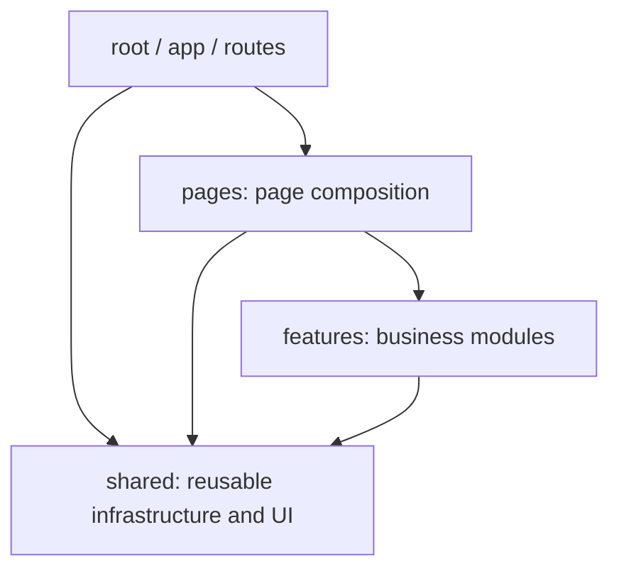

API 不全部塞進共用資料夾：`features/projects/api/` 擁有專案端點，`shared/api/` 處理 HTTP、timeout、取消、錯誤與共用分頁機制。feature 透過 `index.ts` 提供對外介面；多功能協作交給 page，`shared` 不反向依賴 feature。新增方法或元件前先查現有共用介面；可重用的能力集中維護，函式／hooks／CSS 註解說明目的、契約與生命週期，元件及 page 的中英文 SPEC 更新於[前端 README](frontend/README.md)。

Feature API directories own endpoint semantics; `shared/api/` handles transport, timeouts, cancellation, errors and pagination infrastructure. Export feature interfaces through `index.ts`, coordinate features at page level, and keep shared code independent of features. Check existing interfaces before adding helpers. Document function, hook and CSS responsibilities, and update component/page specifications in the frontend guide in both languages.

## API 範圍 / API scope

後端已提供以下六支公開讀取 API，另有一支系統診斷 API：

The backend exposes six public read APIs and one system diagnostic API:

| 路徑 / Endpoint                   | 內容                                                      | Content                                             |
| --------------------------------- | --------------------------------------------------------- | --------------------------------------------------- |
| `GET /portfolio/site`             | 品牌、個人介紹、社群與聯絡入口                            | Brand, profile, social links, and contact entry     |
| `GET /portfolio/journey`          | 完整旅程與地圖資料                                        | Complete journey and map data                       |
| `GET /portfolio/experiences`      | 學經歷與技能，每頁 6 筆                                   | Education/work experience and skills, six per page  |
| `GET /portfolio/projects`         | 專案、完整詳情與技能，每頁 6 筆                           | Projects with full details and skills, six per page |
| `GET /portfolio/skill-categories` | 技能分類頁碼分頁；每類包含最多 6 個技能的內層 skills 分頁 | Numbered categories with nested skill preview pages |
| `GET /portfolio/skills`           | 指定分類下的技能頁碼分頁                                  | Numbered skills in one category                     |
| `GET /system/heartbeat`           | 依近期心跳估算目前在線人數                                | Estimated online count from recent heartbeats       |

Portfolio API 以 `locale=en` 為預設，另支援 `zh-Hans`、`zh-Hant`；六支 GET 均可透過 `is_caching=true` 啟用短時間回應快取。目前只有單份 Portfolio，未建立多作者資料隔離；後端登入驗證、管理後台、寫入與上傳功能尚未實作。參數與回應格式見[後端 README](backend/README.md)。

Portfolio APIs default to `locale=en` and also support `zh-Hans` and `zh-Hant`. All six GETs can opt into short-lived response caching with `is_caching=true`. The backend currently serves one Portfolio; multi-author isolation, login, administration, write operations, and uploads are not implemented. See the [backend README](backend/README.md) for parameters and response shapes.

## 從乾淨 checkout 安裝 / Install from a Fresh Checkout

先安裝 Git、[uv](https://docs.astral.sh/uv/getting-started/installation/)、[Node.js 24](https://nodejs.org/en/download) 與 Redis。Python 基線為 3.13（`.python-version`），前端基線為 Node.js 24.21.0／npm 11.19.0（`frontend/.node-version`、`packageManager`）；Python 套件與 npm 套件分別由鎖定檔重建。SQLite driver 隨 Python 依賴安裝，使用預設 SQLite 不需要另啟資料庫服務；Redis 則須獨立啟動。

Install Git, uv, Node.js 24 and Redis first. The repository pins Python 3.13 and the frontend baseline of Node.js 24.21.0/npm 11.19.0. Lockfiles reproduce package dependencies. The default SQLite backend needs no separate database service, while Redis must run independently.

```bash
git clone https://github.com/zhenglee315/portfolio-modern.git
cd portfolio-modern
```

接著依序完成後端服務與資料初始化，再在另一個終端機啟動前端。完整後端說明見[後端安裝步驟](backend/README.md)，前端環境與部署說明見[前端安裝步驟](frontend/README.md#開發與驗證--development-and-verification)。

Initialize backend services and data first, then run the frontend in a separate terminal. The linked guides explain configuration, data import and deployment in detail.

## 後端本機開發 / Local backend development

在專案根目錄執行：

Run from the repository root:

```bash
cd backend
uv python install 3.13
uv sync --locked
```

`uv sync --locked` 依既有鎖定檔建立 `.venv` 與依賴，預設包含開發依賴；若 manifest 與 lock 不一致會停止，避免安裝時默默改版。

`uv sync --locked` creates `.venv` from the committed lockfile, including development dependencies, and fails if the manifest and lock disagree.

新增正式依賴與開發依賴的方式：

To add runtime or development dependencies, replace the placeholders below with package names:

```bash
uv add <package-name>
uv add --dev <development-tool-name>
```

以上 `<package-name>` 與 `<development-tool-name>` 為佔位符，執行前請替換為實際套件名稱。

在 VS Code 選擇 `backend/.venv/bin/python` 作為 Python interpreter；終端機也可手動啟用環境：

Select `backend/.venv/bin/python` as the Python interpreter in VS Code. You can also activate the environment manually in a terminal:

```bash
# 於 backend 目錄執行 / Run inside backend
source .venv/bin/activate
python -c "import sys; print(sys.executable)"
```

不手動啟用環境時，可使用 `uv run` 執行專案指令。例如檢查 Python 排版：

Use `uv run` to execute project commands without manually activating the environment. For example, check Python formatting:

```bash
uv run black --check .
```

公開的 `SYSTEM/config.yaml` 預設使用 loopback、8080、SQLite 與本機 Redis 6379。先依 [Redis 安裝文件](https://redis.io/docs/latest/operate/oss_and_stack/install/install-stack/homebrew/)啟動 Redis；macOS 已安裝 Homebrew 時可執行：

The published YAML uses loopback port 8080, SQLite and local Redis on 6379. Start Redis first; on macOS with Homebrew:

```bash
brew install redis
brew services start redis
redis-cli ping
# Expected: PONG
```

在 `backend/` 執行 migration；新資料庫沒有作品集內容。若要使用既有公開示例，可將 [portfolio-web](https://github.com/zhenglee315/portfolio-web) clone 到與本專案同層，再執行一次匯入：

Apply migrations from `backend/`. A new database has no profile content. To seed the existing public example, clone portfolio-web beside this repository and import it once:

```bash
# Run inside backend/
uv run --locked alembic upgrade head
git clone https://github.com/zhenglee315/portfolio-web.git ../../portfolio-web
uv run --locked test.py
uv run --locked manage_fastapi.py
```

已經有 `portfolio-web/` 時省略 clone；也可用 `uv run --locked test.py --mock-dir /path/to/mock` 指定自己的合規三語資料。匯入只允許空的 Portfolio 資料表，沒有清空或覆寫既有資料的步驟。後端可先以空資料啟動；前端正式預先渲染則需要三語有效的 Site 內容。文件位於 `http://127.0.0.1:8080/swagger`。目前 `uv run backend` 是 uv 範例，不是 API 啟動入口。

Skip cloning if the sibling repository already exists, or pass your own valid three-language mock directory. The importer requires empty Portfolio tables and does not overwrite existing data. Empty-data backend development is supported; a production frontend build needs valid Site content in every locale. API documentation is at `http://127.0.0.1:8080/swagger`. The `backend` console script remains an example; use `manage_fastapi.py` to start the API.

`SECURITY.secret_key` 是明確標示的開發佔位值，正式環境必須更換為隨機私密金鑰。設定在 Python 匯入時讀取，修改後需重啟；目前沒有自動環境變數覆寫 YAML 的機制，部署時應掛載私有 `SYSTEM/config.yaml`。詳細欄位與金鑰產生方式見後端 README。

The signing key is a development-only placeholder and must be replaced with a random private value in production. Configuration loads at Python import time, so edits require a restart. YAML currently has no automatic environment override; mount a private `SYSTEM/config.yaml` for deployment.

## 前端本機開發 / Local frontend development

使用 Node.js 24 與 npm，在專案根目錄執行：

Use Node.js 24 and npm. From the repository root:

```bash
cd frontend
npm ci
cp .env.example .env.local
npm run dev
```

首次安裝才複製 `.env.example`，保留已有 `.env.local` 的個人設定。預設 proxy 與 build target 都是後端 8080；若更換 API 位址，同時調整兩者。開發頁面位於 `http://127.0.0.1:5173`，支援 `/`、`/en`、`/zh-Hans` 與 `/zh-Hant`。`npm run check` 執行型別、lint、格式、單元測試與建置，建置時需要已匯入內容的 API。瀏覽器測試另需 `npx playwright install chromium`，然後依序執行 `npm run test:dev` 與 `npm run test:e2e`；兩套測試共用 4181 fixture API，須分開執行。

Copy the environment example only on first setup; preserve existing local settings. Both default API targets point to port 8080. Development runs on port 5173 with four locale URLs. Standard checks include a build against seeded API content. Install Chromium before running the development and production browser suites sequentially, since both manage the same fixture API port 4181.

## 前後端正式部署 / Production Deployment

以下以**單台 Linux 主機、systemd、Nginx、Redis 與 SQLite** 為可重現範例。前端目前是 React Router 的靜態預先渲染模式：正式發布 `frontend/build/client/`，由 Nginx 提供檔案；後端 FastAPI 由 systemd 常駐。瀏覽器以同源 `/api/` 請求後端，前後端仍各自建置與發布。

This example uses **one Linux host with systemd, Nginx, Redis and SQLite**. React Router produces pre-rendered static files in `frontend/build/client/`, served by Nginx. systemd keeps FastAPI running. The browser uses same-origin `/api/` requests while frontend and backend retain separate build and release steps.

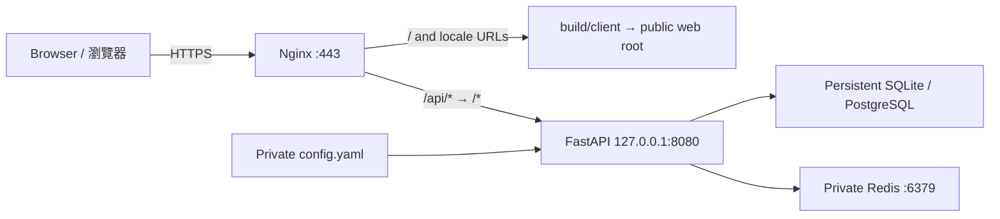

### 1. 準備部署環境 / Prepare the Deployment Host

先準備 Python 3.13／uv、Nginx、Redis、rsync，以及非 root 執行帳號 `portfolio`。建置機另需專案指定的 Node.js 24／npm 11；只接收靜態產物的 Nginx 主機不需要 Node.js。下列 systemd 指令以 Debian／Ubuntu 的 `redis-server.service` 為例，其他發行版須調整服務名稱。Python 與 uv 必須安裝在 `portfolio` 可存取的環境，避免把虛擬環境指向 root 私有目錄中的 interpreter。

Prepare Python 3.13/uv, Nginx, Redis, rsync and a non-root `portfolio` service account. The build machine also needs the repository's Node.js/npm versions; a static-only host needs no Node.js runtime. This example uses Debian/Ubuntu's `redis-server.service`; adapt service names for other distributions. Install uv and Python where the service account can access them.

| 範例值 / Example                                  | 用途 / Purpose                                                                                                    |
| ------------------------------------------------- | ----------------------------------------------------------------------------------------------------------------- |
| `portfolio.example.com`                           | 網站網域，DNS 指向主機並備妥有效 TLS 憑證。 / Website domain with DNS and a valid TLS certificate.                |
| `/srv/portfolio-modern/backend`                   | 後端部署副本，不含 `.git`、開發虛擬環境或資料庫。 / Backend deployment copy, separate from the checkout and data. |
| `/etc/portfolio-modern/config.yaml`               | 私有正式配置的保存位置。 / Private production configuration source.                                               |
| `/var/lib/portfolio-modern/portfolio.sqlite`      | 持久化 SQLite，更新程式時保留。 / Persistent SQLite database retained across code updates.                        |
| `/var/www/portfolio-modern`                       | Nginx 公開目錄，只接收 `build/client`。 / Public web root containing only the client artifact.                    |
| `/etc/ssl/portfolio/fullchain.pem`、`privkey.pem` | Nginx 範例中的憑證與私鑰路徑。 / Certificate and private-key paths used below.                                    |

上述帳號、網域與路徑均為範例；執行前替換為部署環境的值。此流程將網站放在網域根路徑，支援 `/`、`/en`、`/zh-Hans`、`/zh-Hant`。目前沒有配置 `/portfolio/` 子路徑的 basename／asset base；若要沿用舊站子路徑，須另外調整路由、資產與 SEO URL。

Replace these account, domain and path examples before running the commands. Hosting is at the domain root with four locale URLs. A `/portfolio/` subpath requires additional route, asset-base and SEO configuration.

### 2. 安裝後端與私有配置 / Install the Backend and Private Configuration

取得要發布的原始碼後，在 checkout 根目錄將後端複製到部署位置。先建立 `portfolio` 帳號，再以管理者執行：

After checking out the intended release and creating the service account, copy backend sources from the repository root as an administrator:

```bash
sudo install -d -o portfolio -g portfolio /srv/portfolio-modern/backend /var/lib/portfolio-modern
sudo install -d -m 0750 -o root -g portfolio /etc/portfolio-modern
sudo rsync -a --chown=portfolio:portfolio \
  --exclude='.venv/' --exclude='.env*' --exclude='__pycache__/' --exclude='.pytest_cache/' \
  --exclude='/SYSTEM/config.yaml' --exclude='/SYSTEM/models/sqlite/' \
  backend/ /srv/portfolio-modern/backend/
```

**首次部署**才用公開模板初始化私有配置；已有正式配置時保留它，省略第一行 `install`。複製完整 YAML，再編輯下面列出的值，其他必要區段一併保留：

Initialize the private configuration from the public template **only on first deployment**. Preserve an existing production file by skipping the first command. Copy the full YAML and edit the fields below without dropping other required sections:

```bash
sudo install -m 0640 -o root -g portfolio backend/SYSTEM/config.yaml /etc/portfolio-modern/config.yaml
sudoedit /etc/portfolio-modern/config.yaml
sudo install -m 0640 -o root -g portfolio /etc/portfolio-modern/config.yaml /srv/portfolio-modern/backend/SYSTEM/config.yaml
```

| YAML 欄位 / Field                | 正式環境設定 / Production Setting                                                                                                                                            |
| -------------------------------- | ---------------------------------------------------------------------------------------------------------------------------------------------------------------------------- |
| `SERVER.debug`                   | `false`                                                                                                                                                                      |
| `SERVER.host`、`SERVER.port`     | `127.0.0.1`、`8080`，由同主機 Nginx 轉送。 / Bind behind the local Nginx proxy.                                                                                              |
| `SERVER.worker`                  | `1`；目前入口傳入已建立的 ASGI app，多 worker 須先改成可匯入的啟動方式。 / The current entry passes an instantiated ASGI app; multiple workers need a different entry point. |
| `SERVER.locally`                 | `false`，使 server 與 Redis 各自使用 YAML host／port。 / Read the configured host/port values.                                                                               |
| `SERVER.https`                   | 對外使用 HTTPS 時設為 `true`，控制 Secure cookie；TLS 本身由 Nginx 處理。 / Enable secure cookies for HTTPS; Nginx terminates TLS.                                           |
| `SECURITY.secret_key`            | 替換成部署專用隨機私密金鑰，產生方式見[後端設定](backend/README.md)。 / Replace the development placeholder with a private random key.                                       |
| `CACHE.host`、`CACHE.port`       | 同主機 Redis 為 `127.0.0.1`、`6379`。 / Use the private Redis address.                                                                                                       |
| `DATABASE.META.type`、`is_async` | `sqlite`、`true`。 / Use the async SQLite driver.                                                                                                                            |
| `DATABASE.META.name`             | `/var/lib/portfolio-modern/portfolio.sqlite`；`portfolio` 須可寫入所在目錄。 / Use a persistent absolute path with a writable parent directory.                              |

程式仍從部署副本的 `SYSTEM/config.yaml` 讀取，沒有環境變數覆寫或 `${VARIABLE}` 插值；`/etc` 是此教程選用的私有保存位置。正式值只進部署副本，不回寫 checkout。改用 PostgreSQL 時先建立資料庫，再配置 `type: postgresql` 與實際 `host`、`port`、`name`、`user`、`password`。

The application still reads `SYSTEM/config.yaml` inside the deployment copy; `/etc` is the private source used by this tutorial. Environment overrides and YAML interpolation are not implemented. Keep production values outside the Git checkout. PostgreSQL requires a database created beforehand and real connection fields.

使用部署帳號安裝鎖定的正式依賴並手動遷移資料表。`--no-dev` 排除開發依賴，`--locked` 確保鎖定檔不被安裝動作改寫，見 [uv 官方同步文件](https://docs.astral.sh/uv/concepts/projects/sync/)。

Install the locked runtime dependencies and apply migrations as the service account. uv's `--no-dev` excludes development dependencies and `--locked` enforces the existing lockfile.

```bash
sudo -iu portfolio
cd /srv/portfolio-modern/backend
uv python install 3.13
uv sync --locked --no-dev --python 3.13
uv run --locked --no-dev alembic upgrade head
```

新資料庫還需要三語作品集內容。只有空的 Portfolio 資料表才可執行以下匯入；`/path/to/mock` 請替換為可讀取的公開示例或自己的三語 mock 目錄，來源與格式見[本機後端初始化](#後端本機開發--local-backend-development)。已有資料的正式站省略匯入；SQLite 資料與備份不放在公開 web root。

A fresh database also needs content in all three locales. Import only into empty Portfolio tables, replacing the mock path with a readable example or your own valid dataset. Skip this on a populated site. Keep the database and backups outside the public web root.

```bash
# Optional: empty Portfolio tables only / 僅限空作品集資料表
uv run --locked --no-dev test.py --mock-dir /path/to/mock
```

初始化完成後回到管理者終端機，再建立系統服務。 / Return to the administrator shell before creating the service:

```bash
exit
```

### 3. 以 systemd 啟動後端 / Run the Backend with systemd

建立 `/etc/systemd/system/portfolio-modern-api.service`。使用實際 `.venv` interpreter 執行 `manage_fastapi.py`，讓常駐程序使用前一步安裝的正式依賴：

Create the following service unit. Execute `manage_fastapi.py` through the deployed virtual environment so the service uses the installed runtime dependencies:

```ini
[Unit]
Description=Portfolio Modern API
After=network.target redis-server.service
Wants=redis-server.service

[Service]
Type=simple
User=portfolio
Group=portfolio
WorkingDirectory=/srv/portfolio-modern/backend
ExecStart=/srv/portfolio-modern/backend/.venv/bin/python /srv/portfolio-modern/backend/manage_fastapi.py
Restart=on-failure
RestartSec=5

[Install]
WantedBy=multi-user.target
```

```bash
sudo systemctl enable --now redis-server
redis-cli ping
sudo systemctl daemon-reload
sudo systemctl enable --now portfolio-modern-api
sudo systemctl status portfolio-modern-api
curl --fail 'http://127.0.0.1:8080/portfolio/site?locale=en'
curl --fail 'http://127.0.0.1:8080/portfolio/site?locale=zh-Hans'
curl --fail 'http://127.0.0.1:8080/portfolio/site?locale=zh-Hant'
```

預期 Redis 回傳 `PONG`、服務為 active，三語 Site API 都回傳有效 JSON。修改 YAML 後執行 `sudo systemctl restart portfolio-modern-api`；查錯使用 `sudo journalctl -u portfolio-modern-api -n 100 --no-pager`。目前入口信任 forwarded headers，所以 API 8080 保持 loopback，只由受信任 proxy 存取。服務管理參考 [systemd 官方文件](https://systemd.io/)。

Expect Redis `PONG`, an active API service and valid Site JSON in every locale. Restart the API after YAML changes and inspect its journal for failures. The entry point trusts forwarded headers, so keep port 8080 on loopback behind the trusted proxy.

### 4. 建置與發布前端 / Build and Publish the Frontend

在建置機 checkout 的 `frontend/` 執行 `npm ci`，包含 Vite／TypeScript 等建置依賴。建立或更新被 Git 忽略的 `.env.production.local`，只保留需要的部署設定：

Run `npm ci` in the checkout's `frontend/` on the build machine, including build dependencies. Create or update the ignored `.env.production.local`:

```dotenv
VITE_API_BASE_URL=/api
API_PROXY_TARGET=http://127.0.0.1:8080
API_BUILD_TARGET=http://127.0.0.1:8080
VITE_PUBLIC_SITE_URL=https://portfolio.example.com
```

| 變數 / Variable        | 使用時機 / Usage                                                                                                                                                                                    |
| ---------------------- | --------------------------------------------------------------------------------------------------------------------------------------------------------------------------------------------------- |
| `VITE_API_BASE_URL`    | 瀏覽器 API 前綴，同源部署使用 `/api`。 / Browser API prefix.                                                                                                                                        |
| `API_BUILD_TARGET`     | 建置期間實際可連線的 API；同主機可用 loopback，遠端建置則改成可達的 API，例如 `https://portfolio.example.com/api`。 / Reachable API for pre-rendering; include `/api` when using the website proxy. |
| `API_PROXY_TARGET`     | 開發／本機 preview proxy 上游，正式 Nginx 不讀取此值。 / Development and preview upstream, independent of Nginx.                                                                                    |
| `VITE_PUBLIC_SITE_URL` | 網站 origin，用於 canonical、hreflang 與 Open Graph，不含子路徑。 / Public origin for absolute SEO URLs.                                                                                            |

所有 `VITE_` 值會進入用戶端，不能放金鑰。正式 mode 會讀取 `.env.production.local`；shell 已設定的同名變數優先，因此建置前也要確認沒有舊的 target。修改這些值後須重新建置。載入順序見 [Vite 官方環境設定](https://vite.dev/guide/env-and-mode)。

`VITE_` values are public client configuration and must contain no secrets. Production mode reads `.env.production.local`, while existing process environment values take priority. Rebuild after changes and check for stale shell targets.

```bash
# Run inside frontend/ / 於 frontend 執行
npm ci
npm run check
npm run verify:public
```

`check` 包含型別、lint、格式、單元測試與正式建置；Site API 三語內容必須有效。建置先驗證完整產物，再替換上一份 `build`。如需瀏覽器驗證，先安裝 Chromium，再**依序**執行 `npm run test:dev`、`npm run test:e2e`；兩者會建立合成資料產物，因此發布前必須再以正式 `API_BUILD_TARGET` 執行 `npm run build` 與 `npm run verify:public`。

The check command runs types, lint, formatting, unit tests and a production build requiring valid Site data in every locale. Builds replace the previous artifact only after acceptance. Optional browser suites run sequentially and produce synthetic snapshots; rebuild against the production API and verify again before publishing.

只複製 `build/client/` 的內容到 web root。以下在部署主機的 `frontend/` 產物目錄操作，先發布新的 hashed assets，再發布 HTML／route data；保留舊 assets，讓尚未重新整理的頁面仍可取得舊 chunk：

Publish only `build/client/`. With the accepted artifact on the host, copy new hashed assets first, then HTML and route data. Retain old assets so existing browser sessions can load their previous chunks:

```bash
sudo install -d /var/www/portfolio-modern/assets
sudo rsync -a --chmod=D755,F644 build/client/assets/ /var/www/portfolio-modern/assets/
sudo rsync -a --chmod=D755,F644 --exclude='/assets/' build/client/ /var/www/portfolio-modern/
```

web root 不放原始碼、`build/server`、`.env`、YAML、資料庫或備份。舊資產在確認不再支援舊頁面後另行清理。`npm run dev` 與 `npm run preview` 用於開發及本機驗證；本部署方式不需要 Node.js 常駐服務。

Keep sources, server build output, environment files, YAML, databases and backups outside the web root. Retire old assets separately after their supported lifetime. Development and preview commands are local tools; this deployment needs no persistent Node.js process.

### 5. 設定 Nginx 與 HTTPS / Configure Nginx and HTTPS

通用模板位於 [`frontend/deploy/nginx.conf.example`](frontend/deploy/nginx.conf.example)。該檔的 `backend:8080` 是容器網路上游範例；本機 systemd 部署改成 `127.0.0.1:8080`。先準備網域與有效憑證，再將以下設定存入 `/etc/nginx/sites-available/portfolio-modern.conf`，替換範例網域及憑證路徑：

The generic template uses a container-network upstream. For this systemd deployment, use loopback instead. Prepare DNS and a valid certificate, then save this adapted configuration with your domain and certificate paths:

```nginx
server {
    listen 80;
    server_name portfolio.example.com;
    return 301 https://$host$request_uri;
}

server {
    listen 443 ssl;
    server_name portfolio.example.com;
    ssl_certificate /etc/ssl/portfolio/fullchain.pem;
    ssl_certificate_key /etc/ssl/portfolio/privkey.pem;

    root /var/www/portfolio-modern;
    index index.html;

    # Strip /api/ and preserve API errors / 移除前綴，保留 API 錯誤
    location ^~ /api/ {
        proxy_pass http://127.0.0.1:8080/;
        proxy_set_header Host $host;
        proxy_set_header X-Forwarded-Proto $scheme;
        proxy_set_header X-Forwarded-For $remote_addr;
        proxy_read_timeout 15s;
    }

    # Cache versioned assets; missing files remain 404 / 版本資產快取與 404
    location ^~ /assets/ {
        try_files $uri =404;
        add_header Cache-Control "public, max-age=31536000, immutable";
    }

    # Revalidate route snapshots / 路由資料每次重新驗證
    location ~ \.data$ {
        try_files $uri =404;
        add_header Cache-Control "no-cache";
    }

    # Locale pages and SPA fallback / 語系頁面與 fallback
    location / {
        try_files $uri $uri/ /__spa-fallback.html;
        add_header Cache-Control "no-cache";
    }
}
```

`proxy_pass` 尾端的 `/` 將 `/api/portfolio/site` 轉成 `/portfolio/site`；API location 不套用 SPA fallback。HTTPS 與 URI 轉送規則分別見 [Nginx HTTPS 文件](https://nginx.org/en/docs/http/configuring_https_servers.html)與 [proxy_pass 文件](https://nginx.org/en/docs/http/ngx_http_proxy_module.html#proxy_pass)。同源方案符合目前後端 CORS；若改成不同網域直連 API，須修改並驗證 `SYSTEM/settings.py` 的 CORS origins，沒有可直接填入 YAML 的 origins 欄位。

The trailing slash strips the `/api/` prefix; API failures never fall back to application HTML. Same-origin proxying works with the current backend configuration. Direct cross-origin access needs a verified CORS change in `SYSTEM/settings.py`; YAML has no origins option.

```bash
sudo ln -sfn /etc/nginx/sites-available/portfolio-modern.conf /etc/nginx/sites-enabled/portfolio-modern.conf
sudo nginx -t
# Reload only after the configuration check succeeds / 檢查成功才重載
sudo systemctl reload nginx
```

### 6. 部署驗收 / Verify the Deployment

```bash
curl --fail --head --location https://portfolio.example.com/
curl --fail --head --location https://portfolio.example.com/en
curl --fail --head --location https://portfolio.example.com/zh-Hans
curl --fail --head --location https://portfolio.example.com/zh-Hant
curl --fail 'https://portfolio.example.com/api/portfolio/site?locale=en'
curl --head https://portfolio.example.com/assets/missing-file.js
```

四個頁面應成功回應，API 應回傳 JSON，缺少的 assets 應回傳 `404`。瀏覽器再確認切語言、主題與進場動畫、導覽、地圖、timeline、技能展開、專案詳情、聯絡面板，以及手機／平板／桌面的排版。API 中斷時，各區段應保留可用資料或顯示錯誤／無資料提示，頁面仍可操作。

Expect successful locale pages, JSON from the API and `404` for missing assets. Check language/theme transitions, navigation, map, timeline, skill expansion, project details and contact UI across mobile, tablet and desktop. API failure should leave available content or section-level feedback while the page remains usable.

### 7. 後續更新與資料保留 / Updates and Data Retention

1. 在 web root 以外備份資料庫與私有 YAML，保留上一份已驗收前端產物；SQLite 使用一致性備份或停寫後複製。 / Back up the database and private configuration outside the web root, using a consistent SQLite backup; retain the accepted client artifact.
2. 取得指定版本的原始碼，依步驟 2 同步後端；保留私有配置與持久化 DB，先安裝鎖定依賴，再視 migration 內容安排遷移及 API 重啟。 / Sync the intended release while retaining private configuration and persistent data; install locked dependencies, then plan migrations and restart.
3. 完成驗證後用正式 API 重新建置前端，再依步驟 4 發布；前端發布通常不用重啟 API。 / Build and publish the frontend against the production API after validation; a frontend release normally needs no API restart.
4. 修改個人介紹、經歷等後端內容時也重新建置與發布，更新預先渲染 HTML／route data 的快照。 / Rebuild after backend content changes so pre-rendered HTML and route data reflect the new content.
5. 重做步驟 6；失敗時恢復已驗收的前端產物或相容的後端版本，資料庫 migration 的回復另外評估。 / Repeat acceptance checks; restore an accepted artifact or compatible backend if needed, assessing database rollback separately.

詳細前端產物、容錯與環境規格見[前端 README](frontend/README.md)，資料庫、初始化與 API 契約見[後端 README](backend/README.md)。

See the frontend guide for artifact and failure-handling details, and the backend guide for database initialization and API contracts.

## 可重建檔案與版本控制 / Reproducible Files and Version Control

| 隨原始碼提交 / Tracked input                                                                        | 安裝或執行時產生 / Regenerated locally                                        |
| --------------------------------------------------------------------------------------------------- | ----------------------------------------------------------------------------- |
| Python／npm manifests、lockfiles、版本檔 / Manifests, locks and runtime pins                        | `.venv/`、`node_modules/` / Installed dependencies                            |
| 前後端原始碼、CSS、三語字典、圖片／地圖／字型與授權 / Sources, styles, locales, assets and licenses | `.react-router/` / Route-generated types                                      |
| migration、維護中的測試與 fixtures、CI／工具設定 / Migrations, tests, fixtures and tooling          | SQLite 檔案／journal、測試報告／cache / Database data and verification output |
| 開發用 `config.yaml`、`.env.example`、README／部署範例 / Safe development configuration and docs    | `.env.local`、`build/` / Local settings and accepted builds                   |

這些輸入檔都屬於專案交付內容；依賴、型別與產物由以上指令重建，因此不需要提交 `node_modules`、虛擬環境或資料庫。需要初始內容時使用公開 mock 匯入流程；個人部署金鑰另行提供。Git 的 `??` 表示尚未追蹤，`!!` 才表示被忽略；發佈新功能時必須一併加入新增 source、assets、tests 與工具檔案，不能只提交 README 或 package.json。

Commit every required input file with a feature. Dependencies, route types and artifacts regenerate from the documented commands; database content comes from the import workflow and deployment secrets are supplied separately. In Git status, `??` means untracked and `!!` means ignored. New source, assets, tests and tooling must accompany the change.

## 文件與版本控制 / Documentation and version control

- 本儲存庫為公開專案；公開文件僅記錄架構、通用開發流程與不含敏感值的設定示例。
- 不在公開文件記錄實際伺服器配置、識別資訊、網路位址、登入資訊、金鑰或憑證。
- 本機工作筆記、暫存資料與私有部署紀錄統一存放於根目錄 `agent/`，該目錄已由 `.gitignore` 排除。
- manifests、lockfiles、完整原始碼與開發預設配置納入版本控制；虛擬環境、個人環境檔、SQLite 資料與正式機密不提交。

- This is a public repository. Public documentation covers architecture, general development workflows, and configuration examples without sensitive values.
- Keep actual server specifications, identifiers, network addresses, login details, keys, and credentials out of public documentation.
- Local working notes, temporary files, and private deployment records belong in the root `agent/` directory, which is excluded by `.gitignore`.
- Track manifests, lockfiles, complete sources and development defaults; keep dependency environments, local environment files, SQLite data and production secrets private.

## 授權 / License

本專案採 MIT License。

This project is licensed under the MIT License.
